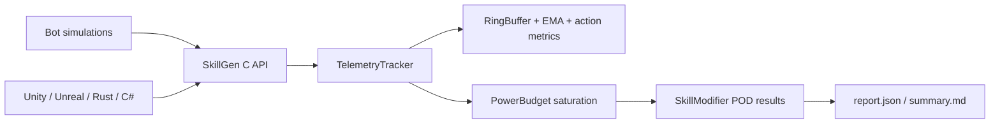

# GameGeneratingSystem

Headless telemetry benchmark and native skill synthesis core. The repository contains a C++20 engine, a stable C ABI, C# bindings, and a reproducible Python harness.

## Architecture



The C++ engine owns native contexts. Each simulation uses its own context, while the tracker protects operations with a mutex. Hot-path event processing uses fixed-capacity storage and does not allocate. The C API never lets C++ exceptions cross the ABI boundary.

## Build the native engine

Requirements: CMake 3.20+, C++20 compiler, and internet access for the first GoogleTest FetchContent download.

```powershell
cmake -S . -B build-capi -G "MinGW Makefiles" -DCMAKE_BUILD_TYPE=Release
cmake --build build-capi --parallel 4
ctest --test-dir build-capi --output-on-failure
```

The build creates `libgame_core.dll` and `libskillgen_c_api.dll` on Windows. Linux and macOS produce the corresponding shared-library extensions.

## C# bindings

Requirements: .NET 8 SDK. The bindings use Cdecl P/Invoke, sequential POD layouts, and `SafeHandle`.

```powershell
dotnet restore bindings/csharp/SkillGen.Tests/SkillGen.Tests.csproj
dotnet test bindings/csharp/SkillGen.Tests/SkillGen.Tests.csproj
```

The test project copies native DLLs from `build-capi`. On Windows, keep both `libskillgen_c_api.dll` and its dependency `libgame_core.dll` beside the test executable or in the DLL search path.

## Run the benchmark

Build the native engine first, then run:

```powershell
python harness/simulation_runner.py
```

The harness runs three concurrent, independent contexts for 5,000 ticks:

- **Speedster**: 80% aggregate Move/Dash, 20% Light Attack;
- **Tank**: 60% aggregate Block/Parry, 40% Heavy Attack;
- **Spammer**: 95% Single Action, used to verify the saturation bound.

Outputs are written to `artifacts/report.json` and `artifacts/summary.md`. The report contains action counts, branch shares, native modifiers, confidence, and a comparison with an intentionally unbounded linear score. The branch claim is based on aggregate category share, not the most frequent single action.

## Interactive arena demo

Requirements: `pygame`. Start the 60 FPS top-down sandbox with:

```powershell
python demo/arena_sandbox.py
```

Manual controls are WASD to move, Space to dash, left mouse for Light Strike, held right mouse for Heavy Strike/Parry, and Q for healing. Press `0` for manual control, `1` for Speedster, `2` for Tank, `3` for Spammer, `R` to reset telemetry, and `S` to save `artifacts/demo_session_report.json`. The side panel shows branch levels, modifiers, soft-cap state, rolling diagnostics, and the live Hill curve. Smoke-test without a window using `python demo/arena_sandbox.py --headless --frames 120`.

## Browser roguelite

The repository also includes a standalone HTML5 Canvas action-roguelite in `web/`. It has procedural arenas, swarmers/rangers/tanks, a Warden bullet-hell boss every fifth wave, dash i-frames, relic choices, status effects, combat text, screen feedback, and live run telemetry. The math helpers in `web/game.js` are pure functions and use the documented DPS and armor formulas.

Start it from the repository root:

```powershell
python -m http.server 4173 --directory web
```

Then open `http://127.0.0.1:4173`. Use `WASD` or arrow keys to move and `Space` to dash. Combat is now automatic: the operator locks onto the nearest living enemy within range only when the line of sight is clear of arena obstacles, then aims and fires without mouse input. Press `P`, `Esc`, or the pause button to freeze the run and open the Telemetry Inspector. It shows the live build, the effective DPS calculation, recent action sequence, and the skill graph generated from your movement, dashes, shots, critical hits, and kills.

The Generative Core is explainable rather than a cosmetic score. Every generated pattern stores its source event/sequence, observation count, threshold, unlock rule, growth rule, current buff, and buff formula. `EVIDENCE` means `observations / threshold`; it measures how strongly the current telemetry supports the pattern, while `LV` controls the size of the effect. For example, `Ballistic Loop` is unlocked after 5 `fire` events and grants `+3% attack speed` per level; `Ashen Rhythm` uses repeated `fire -> fire` sequences and grants `+4% damage` per level. These two generated modifiers are applied to combat, and the pause formula includes their current values.

Pattern telemetry is cumulative for the current run. The visible recent-event list is capped at 80 entries for readability, but it cannot reduce a skill level. Unlock growth uses a soft cap: `level = floor((observations / threshold)^0.74) + 1`, so later levels need increasingly more evidence while progression remains unbounded. Buff strength is also diminishing: `buff = base × level^0.72`, so high levels still improve the build but each additional level gives a smaller increment.

The generator now observes more than movement and shots: target locks, critical hits, kills, damage taken, healing, cleared waves, and action sequences. This can produce defensive and tactical skills such as `Targeting Matrix`, `Survivor Instinct`, `Recovery Loop`, `Floor Architect`, and `Pressure Valve`, whose modifiers are applied to targeting range, mitigation, healing, max HP, and dash distance.

## Unity integration

1. Build the native targets in Release mode.
2. Copy `libskillgen_c_api.dll` and `libgame_core.dll` into `Assets/Plugins/x86_64/`.
3. Reference the C# bindings project or copy its source into the Unity solution.
4. Create one `SkillGenClient` per player/session and dispose it when the session ends.
5. Call `PushAction(actionId, value, tags)` from gameplay events; call `GetActiveSkills()` at a controlled evaluation cadence rather than every frame.

Example:

```csharp
using var client = new SkillGenClient();
client.PushAction("dash", 1.0f, ["movement", "combat"]);
var skills = client.GetActiveSkills();
```

## Unreal integration

1. Build the shared libraries and copy them into the project binary directory.
2. Add `include/` to the module's include paths and link the import library (`libskillgen_c_api.dll.a` for MinGW or the platform equivalent).
3. Include `SkillGen_C_API.h` from a C++ game module.
4. Create and destroy a context on the owning subsystem, not per frame.
5. Pass only fixed-layout POD structs across the boundary and check every returned status code.

The C API is also suitable for Rust FFI: bind the opaque `SkillGen_Context`, reproduce the sequential structs, use C strings for baseline names, and call `skillgen_destroy_context` through an RAII wrapper.

## Safety and limits

The C ABI is stable at the function/type level, but callers must use the same target architecture and calling convention. `SkillGen_SkillModifier.action_name` is a 64-byte fixed buffer. Do not retain native pointers after destroying a context. The current prototype's saturation cap bounds repetitive modifiers; production balance policy can add server-side gates and audit logging around the same API.
